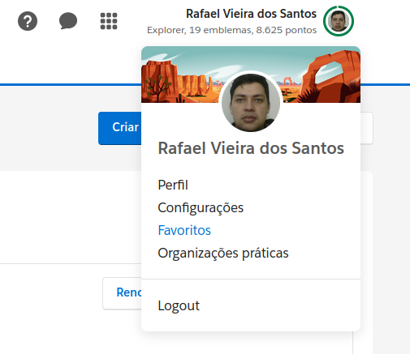
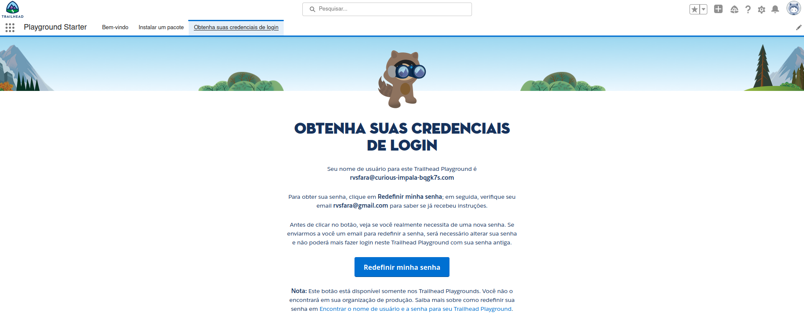

# Trailhead e Trailblazer
Trailblazer é comunidade

Trailhead é curso

O Trailhead e a Trailblazer Community são parte de uma plataforma unificada. A Trailblazer Community ajuda você a aprender habilidades relevantes, a se conectar com outros Trailblazers e a retribuir.

## Trailhead Playground

Trailhead Playground é uma organização que você pode usar para desafios práticos, aprender novos recursos e testar personalizações.

1º Para criar uma organização ou Trailhead Playground Clicar em Perfil do
usuário em cima da foto, depois organizações práticas.

2º Botão Criar Playgroud e dar um nome.

## Obter seu nome de usuário e redefinir a sua senha

Primeiro, inicie seu Trailhead Playground clicando em Iniciar.

