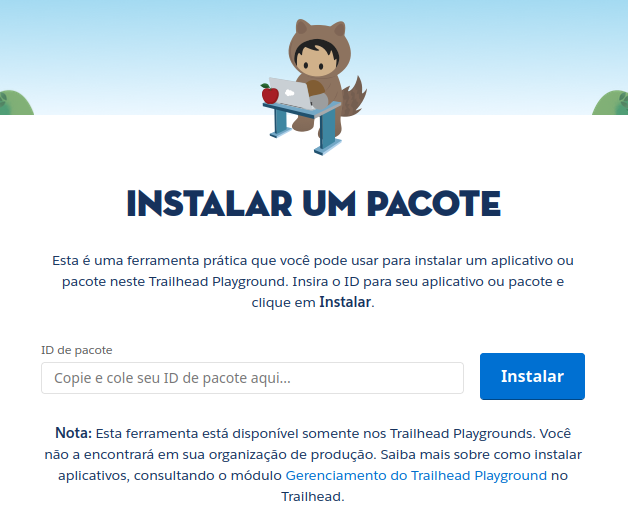
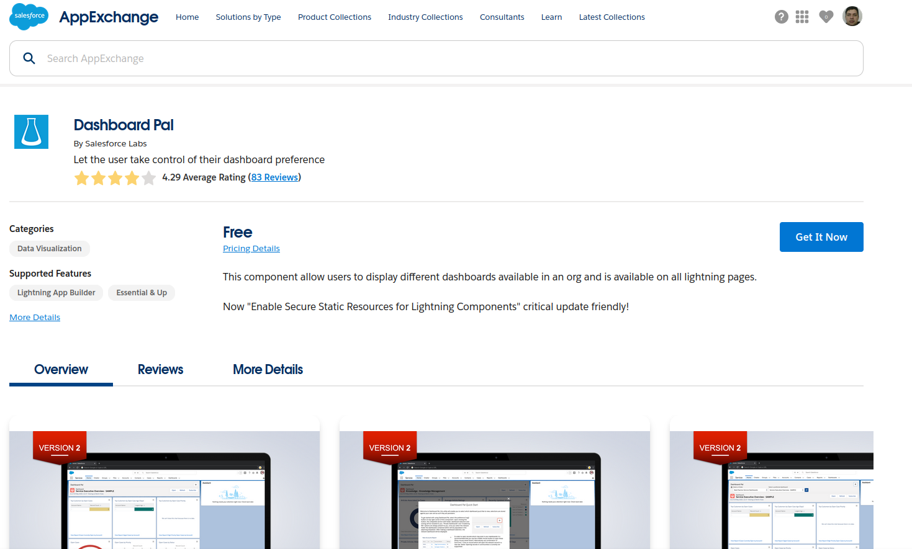

# Trailhead e Trailblazer
Trailblazer é comunidade

Trailhead é curso

O Trailhead e a Trailblazer Community são parte de uma plataforma unificada. A Trailblazer Community ajuda você a aprender habilidades relevantes, a se conectar com outros Trailblazers e a retribuir.

## Trailhead Playground

Trailhead Playground é uma organização que você pode usar para desafios práticos, aprender novos recursos e testar personalizações.

1º Para criar uma organização ou Trailhead Playground Clicar em Perfil do
usuário em cima da foto, depois **organizações práticas**.

2º Botão Criar Playgroud e dar um nome.

## Obter seu nome de usuário e redefinir a sua senha

Primeiro, inicie seu Trailhead Playground clicando em Iniciar.

Caso não tenha o Playgroud Starter

1. Inicie seu Trailhead Playground clicando em Iniciar em qualquer desafio prático.
2. Clique em Configuração e selecione Configuração.
3. Digite Usuários na caixa Busca rápida e selecione Usuários.
4. Localize seu nome na lista de usuários. Selecione a caixa ao lado do seu nome. Anote o nome de usuário. Este é o nome de usuário do seu Trailhead Playground.
5. Clique em Redefinir senha(s) e OK. Isso envia um email para o endereço associado ao seu nome de usuário. Verifique sua pasta de spam caso você não veja esse email.

## Instalar aplicativos (Pacotes)
O Salesforce tem uma comunidade de parceiros que utilizam a flexibilidade da Salesforce Platform para criar aplicativos incríveis que todos podem usar. Esses aplicativos estão disponíveis para instalação no AppExchange (alguns gratuitos, outros pagos).
[AppExchange](https://appexchange.salesforce.com/)

Se seu Playground tem o aplicativo Playground Starter, siga estas etapas para instalar um aplicativo ou pacote.

1. Encontre a ID do pacote que começa com 04t e copie-a para sua área de transferência.
2. Clique na guia Install a Package (Instalar um pacote).
3. Cole a ID do pacote no campo.
4. Clique em Install (Instalar).
5. Selecione Install for Admins Only (Instalar apenas para administradores) e clique em Install (Instalar).
6. Se você vir um pop-up que pede a aprovação do acesso de terceiros, selecione Yes, grant access to these third-party websites (Sim, conceder acesso a esses sites de terceiros) e clique em Continue (Continuar).

Caso não tenha o app Playgroud Starter
1. Abra o AppExchange em uma nova guia. (Certifique-se de usar uma nova aba; não navegue até o AppExchange através do menu Configuração.)
2. Clique em seu avatar para abrir o menu da conta do Trailblazer.me e clique em Configurações.
3. Na seção Contas do Salesforce, clique em Conectar.
4. Se você vir a página Escolher um nome de usuário, clique em Fazer login com um nome de usuário diferente. Se você vir uma página de login, pule para a próxima etapa.
5. Insira o nome de usuário e a senha do Trailhead Playground e clique em Fazer login.
6. Clique em Vincular conta.
7. Localize a oferta do AppExchange que você está procurando (o componente Dashboard Pal do Salesforce Labs, por exemplo).
8. Clique em Obter agora.

